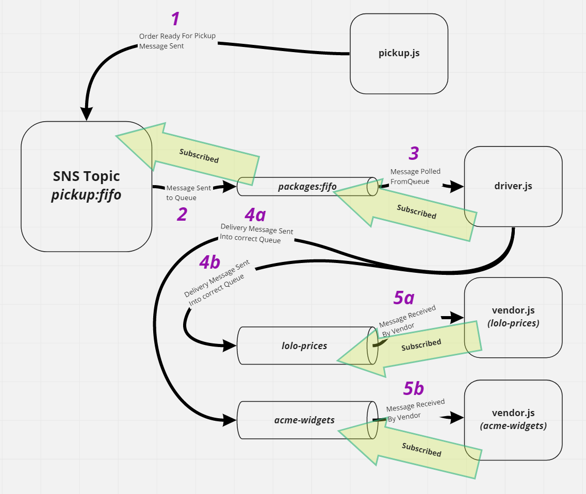

# Caps-Cloud
---

## Overview

Using only AWS Services: SQS, SNS, Lambda, create a cloud version of the CAPS system

## Author: William Moreno

## Collaborators

- James Gerstenberger
- Nick Abramowicz

## Getting Started

- Clone the repository
- `cd` into the main and sub-directories in each of them:
  - `npm install`
- In separate terminals for each sub-directory run the following commands:
  1. In `pickup` execute `node pickup.js`
  1. In `driver` execute `node driver.js`
  1. In `vendor` execute `node vendor.js`
  1. In `vendor2` execute `node vendor.js`

Each terminal should be console logging orders as they move from pickup to the packages queue to the driver to one of the vendor queues and finally are reported delivered by one vendor or the other.

## Features

The app is comprised of the following components:

- A SNS FIFO Topic named `pickup:fifo`
- A SQS FIFO Queue named `packages:fifo` (subscribed to the `pickup:fifo` topic)
- A SQS Queue named `acme-widgets`
- A SQS Queue named `lolo-prices`
- A `pickup.js` file that creates fake orders from a random choice of the two vendors every 1-6 seconds and sends them through the SNS topic into the `packages:fifo` queue.
- A `driver.js` file which is subscribed to the `packages:fifo` queue. Every 2.5-5 seconds it polls one message from the queue and then sends a message into the queue of the vendor the order polled belongs to, before deleting the message from the `packages:fifo` queue.
- Two `vendor.js` files which function exactly the same except for the vendor ID and the queue they are subscribed to. The file polls the SQS queue it is subscribed to continuously. If a delivery message is received, it is console.logged and removed from the queue.

In addition, if the driver or either vendor program are temporarily stopped, they will start polling messages once they are restarted.

## Process

The SNS topic and SQS queues were created first, with the fifo queue being subscribed to the fifo topic upon creation. The pickup .js file was then created in order to start populating the system with messages. The driver.js file was created next and subscribed to the fifo queue and set up to publish to the vendor queues. Lastly the vendor.js files were created and subscribed to their respective SQS queues. The system was then observed in it's running state to verify functionality.

## UML

UML drawing created with [miro](https://miro.com/)

